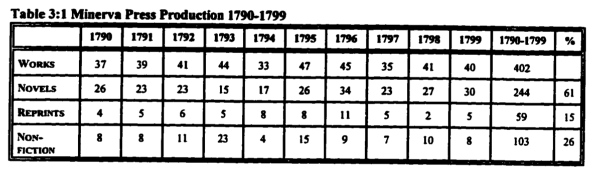
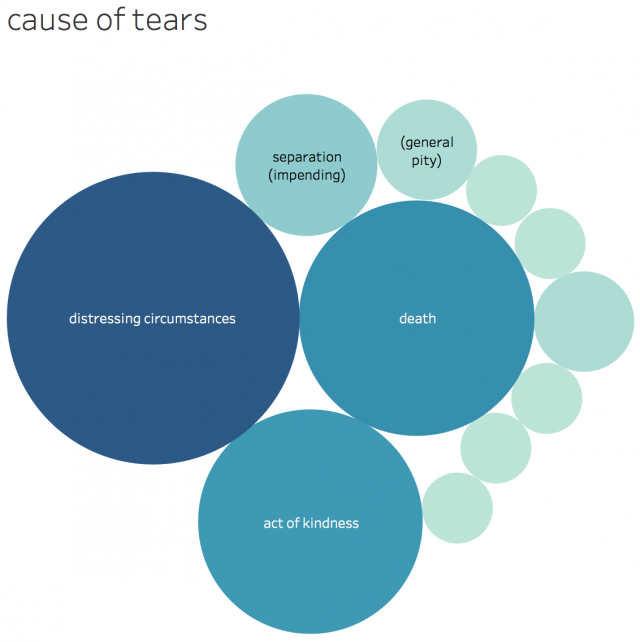
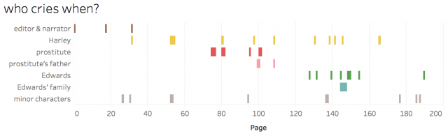

Title: DISSERTATION
Author: Lawrence Evalyn

# Proposal #

## background ##

This dissertation will build on my previous research on the Gothic novel 1790-1830. Late eighteenth-century literary production, as the period’s critics anxiously noted, was characterized by excessive volume. The English Short Title Catalogue (ESTC) records roughly sixteen thousand works published in England the 1730s, a figure which has doubled by the 1780s (which see thirty-two thousand works), and tripled by the 1790s (which see forty-eight thousand). As circulating libraries, too, increased in number, each book could reach more readers. In this context of what Michael Gamer describes as “exploding literacy rates accompanied by an increasingly bewildering and diverse collection of reading audiences” (32), it became ever harder to make sense of the literary world as a cohesive whole. My MA research sought to contextualize the novels of Gothic writers Matthew Lewis and Ann Radcliffe by setting them alongside their now-forgotten peers from the shelves of circulating libraries. I was interested in investigating the critical association of these authors with distinctly gendered male and female schools of writing. I examined plot information from two bibliographies of the Gothic, and found that Matthew Lewis’s *The Monk* was, indeed, characteristic of a minor group of “Male Gothic” novels containing elements of horror and violence not to be found in works by women. However, my method did not reveal any corresponding subject matter that was the sole domain of women writers in several hundred novels. Moreover, it revealed many ways in which Ann Radcliffe’s novels were markedly different from the rest of the texts usually assigned to the “school of Radcliffe.” My dissertation will build on this work. I will continue to contextualize Radcliffe among her peers, but I will not begin by trying to isolate the determining characteristics of a self-contained field of “the Gothic.” Instead, my primary aim will be to capture the great variety within the literary realm as a whole in England from 1789 to 1799.

## driving research Qs ##

My plan is to approach the “great unread” of eighteenth-century literature by marrying large-scale descriptive work with meaningful interpretive insight. I will prototype different models of the literary output of my chosen decade in search of a rich, reparative reading of the literary mediascape. Each model will take a different, iterative approach to representing the complex interactions between broad generic traditions in prose fiction, drama, and poetry, and particular writers’ use of these interactions. One of my models will be large and distant: 51,965 bibliographic entries from the ETSC. One model will be smaller and closer: 502 full texts from the Eighteenth Century Collections Online Text Creation Partnership (ECCO-TCP) corpus. And yet another model will occur at a more traditional scale for literary scholarship: key works by key writers, Ann Radcliffe, Charlotte Turner Smith, Hannah More, and Mary Robinson, all of whom wrote prolifically in the period, often as a means to further aesthetic and political goals in a range of literary forms. I will work with the three models simultaneously; I want to allow each to inform the development and interpretation of the others.

## critical context ##

This dissertation enters into a conversation that marks a shift in how to understand late eighteenth-century English literature. It resists both the history of the novel as a teleological one, where each prose work is another step along the path to realism; and a history of Romanticism that centres on the poets’ own myth-making. It thus seeks to follow in the footsteps of scholars such as Michael Gamer, by paying careful attention to the interdependence of generic forms, while casting a much broader net. On a methodological level, this dissertation also engages in current debates about “surface reading” or “literal reading” as undertaken by Sharon Marcus, Heather Love, and Stephen Best, and paranoid modes of criticism resisted in the work of, among others, Eve Sedgwick and Rita Felski. I want to propose the “distant reading” methods promoted by Franco Moretti as one possible means of achieving meaningful surface reading and rich description. Finally, the computational approaches to literary corpora, including new algorithms that I will develop through the research process, will contribute substantively to  the field of the digital humanities, even though these techniques are not the primary motivation for the work I am undertaking in the dissertation. 

## methods ##

### model 1: ESTC ###

The ESTC has records on 51,965 works printed in England during this decade. The ESTC has already provided me with their core bibliographical records of the authors, titles, and imprints for these works. Research by Leo Lahti and others, which examines similar basic bibliographic data for 50,766 works categorized as history in the ESTC, has demonstrated some fruitful techniques for research at this scale. I will deploy these and similar techniques in order to identify influential authors and major groupings of texts. I expect to see, from multiple reprintings of her works, that Ann Radcliffe was an increasingly popular author in my decade, and to find her influence visible in the titles of works published in the wake of her success. 

I will also look in more detail at some subsets of my 51,965 items. Taking cues from Steven Zwicker, I will use random sampling to extract a small enough list that I can research the works’ publication history and content. I believe this will enable me to assemble a frame of reference for the relative popularity of particular generic forms within the mediascape in the late 1700s. By briefly reading these sampled works with an eye to their political content, I also hope to get a sense of the extent to which works in this group openly describe their political agendas.

### model 2: ECCO-TCP ###

I will then turn my attention to a broad corpus of works available to me as full texts. The ECCO-TCP provides carefully-edited full texts of 2,188 works from 1701-1800, of which 502 were published during the decade of interest to me. I may supplement these texts with works from other, smaller scholarly corpora, such as the Chawton House Library corpus of women’s writing; Women Writers Online; the Oxford Text Archive; and digital library holdings like those at the University of Indiana and the University of Michigan. As a first measure, I will compare what is included in these corpora to the more comprehensive ESTC corpus to see how each archive models the decade. I am particularly curious to compare the way that each corpus represents the prominence of my key authors. Then I will turn my attention to the specific language of these works. I may use combinatorial n-gram matching to trace quotations and references, seeking intertextual relationships between my key authors and their peers. I may also employ statistical stylometric analysis to explore characteristic features of their language-- especially those features that mark any them as outliers.

### model 3: reading ###

Finally, I will turn to yet closer readings of a yet smaller corpus, examining the works of a few authors in detail. I seek to understand the idiosyncratic relationship of Ann Radcliffe, Charlotte Turner Smith, Hannah More, and Mary Robinson within the public sphere of letters, and to build an argument about their employment of different generic forms. In order to take full advantage of the affordances of a close-reading model, I will pursue works which have been excluded from digital repositories, especially chapbooks. I will also attend to facsimile editions or first editions to consider the material conditions for some works’ entry into literary circulation. As I read these works, I will seek the connections between them and their context which only human reading can untangle. I will likely supplement my reading with what Lisa Samuels and Jerome McGann dub “deformative” reading practices; I expect to rely on small handmade indexes, timelines, and data visualizations.

## conclusion ##

Although I have described these three ways of modeling the decade 1789-99 in sequence, I will research them in parallel, with an eye to the connections between them. I will look at how each of the three models represents the position of my case study authors among their peers. To interpret those findings, I will consider the construction of each model, to determine what each occludes and what it renders visible. My many disparate approaches will converge on my central question: what texts can be said to be “representative” of this decade? And what do they “represent”?

## works cited ##

*Eighteenth Century Collections Online Text Creation Partnership*. Gale Cengage. Web.

*English Short Title Catalogue*. The British Library. Web.

Felski, Rita. *The Limits of Critique*. Chicago: U Chicago, 2015. Print.

Gamer, Michael. *Romanticism and the Gothic: Genre, Reception, and Canon Formation*. Cambridge: Cambridge UP, 2000. Print. 

Lahti, Leo, Niko Ilomäki, and Mikko Tolonen. “A Quantitative Study of History in the English Short-Title Catalogue (ESTC), 1470-1800.” *LIBER Quarterly* 25.2 (2015): 87–31. Web.

Marcus, Sharon, Heather Love, and Stephen Best. “Building a Better Description.” *Representations* 135.1 (Summer 2016): 2-21. Web.

Moretti, Franco. *Distant Reading*. London: Verso, 2013. Print. 

Samuels, Lisa and Jerome McGann. “Deformance and Interpretation.” *New Literary History* 30.1 (Winter 1999): 25-56. JSTOR. Web. 24 Feb. 2014. 

Sedgewick, Eve. “Paranoid Reading and Reparative Reading, or, You’re So Paranoid, You Probably Think This Essay Is About You.” *Touching Feeling*. Durham, NC: Duke UP, 2003. Print.

Zwicker, Steven N. “Is There Such a Thing as Restoration Literature?” *Huntington Library Quarterly* 69.3 (2006): 425–450. Web.

# Guiding Principles #

Literally every idea I have for “research”, of any kind, goes in this document.

One snippet per “thought.”

Let it all accumulate into groupings organically.

# Research Questions #

## what to do with so much lit? ##

My goal is to do something about the problem of literary canons. How can we cope with the sheer quantity of literature that exists? What is our goal, when we approach literature?

### how to select texts? ###

How do we select a small number of texts, to be “important” or “representative”, from a larger body?

### what do we teach? in what context? ###

What texts should we teach to students? And how should we contextualize them?

### how to identify genres? ###

How do we make sense of intergeneric connections? What is a genre? Why do we have them? What are they for?

### how do literary fads move? ###

do literary fads emerge in plays, poems, and prose simultaneously, or move through them sequentially?

### how do audiences differ? ###

How different are the writers and audiences for each medium?

### what is "normal" in the 1790s? ###

What do my corpora tell us about what was ‘normal’ during my decade?

What does it mean to be “normal” or to seek the “normal” over the exceptional?

### how do we account for variety? ###

One of the things I like about computational methods is that, ultimately, there are no glossy simplifications — one must touch and somehow *account for* the things that don’t fit the pattern

## how political is 1790s lit? ##

I also anticipate finding new insight into the forms and popularity of political writing in the period: how much of the work being consumed is presented with explicit political aims?

### what genres for what politics? ###

What mediums are most-used for different political positions?

## author case studies ##

In a somewhat separate line of inquiry, I will explore in-depth the works of the individuals authors under consideration: how do they use each of the generic mediums available to them? How do they adapt their ideas to each form, and how do they conceive of each audience? 

### how do they use genre? ###

how do they use each of the generic mediums available to them? How do they adapt their ideas to each form, and how do they conceive of each audience? 

### are they "representative"? ###

Both the macro and the micro views will merge in the question: are my key writers ‘representative’ of the popular written discourse in which they participate? What does it mean for a text to be ‘representative,’ and how should we find and understand outliers?

## women in carriages ##

### how often do women get grabbed? ###

How often, in 18thC novels, do women get grabbed into carriages? Is this a stock trope?

- Clarissa

- Emmeline

- ??? Wolfenbach?

### what happens when they're grabbed? ###

What typically happens to them once they get grabbed? Do men and women write different kinds of outcomes?

### why? is it Clarissa? ###

Is it because of Clarissa, or did it start before then?

## Shakespeare in the 18thC ##

### what plays get quoted most? ###

### what parts of plays get quoted most? ###

### do men and women use Shakey differently? ###

### which writers write from full plays, which from extracts? ###

### is Shakespeare an 18thC author? ###

## 18thC transitional tragedy ##

### can I spot the "first" plays to make shifts? ###

Can I make a “canon” of “first outliers” over time?

### what is the role of the audience? ###

If the audience is a node in the social network, can we tell who they are meant to sympathise with?

## what is the "theory" of literary history? ##

Moretti: evolutionary selection? Centre-periphery?

Or is it something else?

Why do we need a theory?

"I set out to explain the logic behind literary survival and oblivion" (Moretti Distant Reading 145)

## what is left out of corpora? ##

### is ECCO "representative"? ###

### is HathiTrust "representative?" or reliable?? ###

# Thoughts #

## "genres are problem-solving devices" ##

What it means for readers to 'like' something: "literary genres are problem-solving devices, which address a contradiction of their environment, offering an imaginary resolution by means of their formal organization. The pleasure provided by that formal organization is therefore more than just pleasure -- it is the vehicle through which a larger symbolic sentiment is shaped and assimilated." (Moretti Distant Reading 141)

## what to teach: convo with Jack ##

From my conversations with Jakob: I have two thoughts which are in tension with each other:

1, Whenever, in literary history, there is a "gap" in which "nothing is written" -- I tend to find that actually just as much was written as usual, but it is either not in the format we expect (e.g., theatrical rather than prose production) or it is, by contemporary standards, "bad."

1A, Whenever, in literary history, works are dismissed as "bad" -- whether his means they are morally corrupting, or poorly crafted, or designed according to unliterary or unserious standards, or simply popular with the "wrong sorts" of people -- I immediately want to read those texts, to the exclusion of the "good" works which stand in contrast to them.

2, I do believe, sentimentally, in the Power Of Literature, as a tool to shape and improve the self, to foster empathy, to... to be Morally Improving. Particularly in a pedagogical setting, particularly for young readers (particularly for myself as a young, marginalized person).

2A, I don't think it can possibly be the case that **all works of literature** are equally well-adapted to the **use** of literature for self-creation. Some texts take more work than others. Especially, again, in a pedagogical setting, where it is important both to provide historical context and to nurture each student's individual reading of the text. So, maybe... if we want to use literature to expand students' worldviews, inculcate empathy, teach humanistic thinking... some texts... will be Good for that... and others will be Bad.

I think the tension resolves for me, right now, in the conclusion that one must **study** everything, and **teach** only the most useful -- always keeping open a bridge by which a student may go from learner to researcher.

Also -- many times the "bad" texts through Idea 1 above are, really, socially marginalized texts of various kinds, which are highly likely to be "good" through Idea 2. The knowledge that there is more than one kind of Literature (and thus more than one kind of Life) is, in itself, one of the things that I think reading can most powefully provide to readers.

So, I am practically allergic to the mere thought of trying to identify Good and Bad texts -- by my own instincts I will then end up only wishing to spend time on my Bad ones -- but I do feel like there is space here to distinguish between the **multiple** uses of literature. If there are **many** lists of Good Books, does that address the fundamental problem at all???

## ballads make ideas catchy ##

Jo Walton’s “single most quoted thing I have ever written” is a song “The Lurkers Support Me In Email” to the tune of “My Bonny Lies Over The Ocean” — because the tune makes the words more memorable, so if the idea itself sticks with you you now have a pre-packaged way to share it

JUST LIKE what Hannah More does when she publishes hymns / the entire song market of the 18thC!! 

## be true to the variety of the period, but also true to its chief emphasis ##

be true to the variety of the period, but also true to its chief emphasis.

## crying in jails ##

Is the stock sentimental trope of crying in a jail marked by continuity or discontinuity in its meaning, during the French Revolution?

[Crying in a jail means something different before and after the Revolution; the uses of emotion gain new possible powers] [So these same sentiments gain new importance and need a new name, the Gothic, when they collide with political realities]

### Man of Feeling crying in jail ###

### Two Shoemakers crying in jail ###

Two Shoemakers: The gaoler observed him drop a tear, and asked the cause. I cannot forget, said he, that the most dissolute of these men is still my fellow-creature. The same GOD made them; the same SAVIOUR died for them; how then can I hate the worst of them? With my advantages they might have been much better than I am; without the blessing of GOD on my good Minister's instructions, I might have been worse than the worst of these. I have no cause for pride, much for thankfulness: let us not be high-minded, but fear.

## performative vulnerability ##

What other ways could I examine performative vulnerability as a social strategy for women?

### men are easily manipulated ###

Men are easily manipulated because they position of power makes it unecessary for them to adeptly perceive situations; they have the privilege of not really seeing the suffering they cause

### women's vulnerability demands intervention ###

Women’s ostentatious vulnerability demands male intervention — if women can manage to be sufficiently vulnerable in front of the right men, they can reach their desired end states

(It creates a vacuum)

### escapism: performative vulnerability works ###

The escapism of the story is not that men won’t kidnap you — it’s that the only strategy you have available to you (performative vulnerability) will work.

# canonical authors aren't obviously exceptional #

"rivals: contemporaries who write more or less like canonical authors... but not quite, and who... seem to be the largest contingent of the 'great unread'" (Moretti Distant Reading 67)

There are so many of them and they look at first glance so similar

(Even for, like, modernism….? Or Romanticism, that first round of glorification of individual genius?)

# always expect power-law distribution #

“Ha-ha! No one expects the power-law distribution!”

We want things to be a few, simple, balanced categories — we especially want there to be two equally-matched sides of a binary — but in fact just about everything follows a power-law distribution, which will necessitate a long-tail “misc” category.

# ESTC: publishers visible over authors #

The decade 1789-99, according to the ESTC corpus, is driven by publishers at least as much as it is by authors. At this scale, no one author can be seen to have particular impact. Even Paine, and More, and Wesley are dwarfed by the volume of work produced by “Great Britain”, and dwarfed again by the works by “null” authors who were not only unsigned at the time but elude bibliographic documentation now.

# ESTC: author development = publisher choice #

Radcliffe is remarkably stable in her choice of publisher

When Smith begins to branch out into more political radical works, she needs to branch out into new publishers as well

Robinson: ???

More accomplishes her stunning volume of work partly by being a publisher as much as she is an author. (See: The Apprentice’s Monitor) Her shifting publisher data is mostly information on the Cheap Repository Tracts. [But I was cautioned that these dates are less reliable! Ignore chronological information over sheer quantity? This also addresses the other difficulties re: there being too many publishers to show as a timeline]

# ESTC: prominence of the "back catalogue" #

Older works will have had more years for people to potentially read them, so that an increase in an author’s popularity also increases the relevance of their older works. A new bestseller like Udolpho supplements The Romance of the Forest, it doesn’t supercede it. Ditto Charlotte Smith’s Elegiac Sonnets.

# 18thC titles intentionally signal contents #

The title of a work was the main ‘advertisement’ available to a text (even author names played a minor role!) so 18thC titles are doing a lot of heavy linguistic signalling of the contents intentionally to locate/interpellate their audiences

# Experiments #

## use of Shakespeare in the 18thC ##

## graphs - index to tears ##

# Primary Texts #

# Secondary Texts #