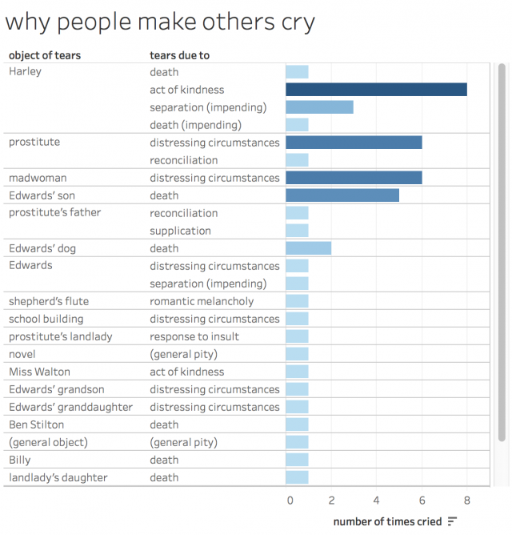
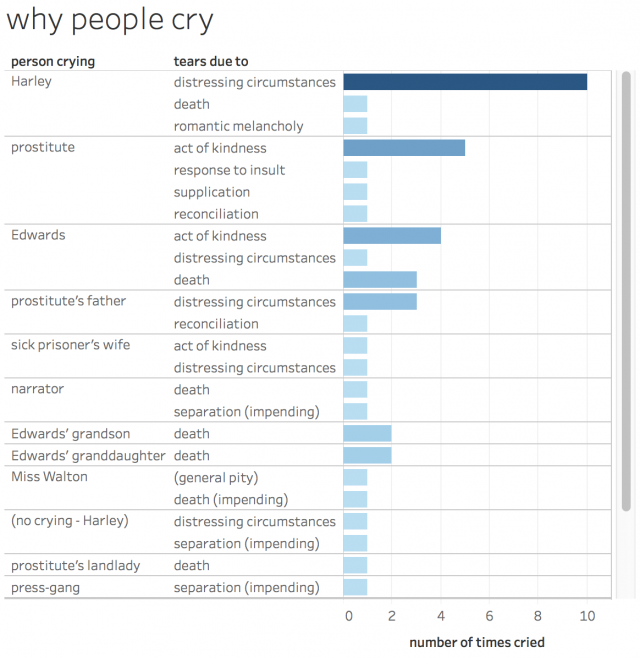
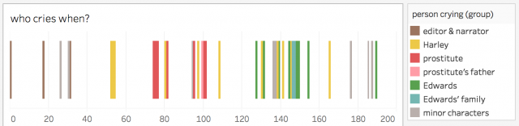

Title: DISSERTATION
Author: Lawrence Evalyn

# OGS Plan of Study (500 wds) #

Indicate what stage you are at in your thesis.

I have passed my Special Fields exams, and am now “all but dissertation,” at the very earliest stages of the writing process.

Provide an outline of your thesis proposal, including, for example, background, hypothesis, context, objectives, methodology, and contribution to the advancement of knowledge.

Clearly state the differences between work already completed for your thesis, what you hope to accomplish during the award tenure, and what will remain to be done before you obtain your degree.

# Guiding Principles #

Literally every idea I have for “research”, of any kind, goes in this document.

One snippet per “thought.”

Let it all accumulate into groupings organically.

Look for crossover between ideas, multiple ways of approaching a given subject. Similarity of experimental method does not in itself constitute a connection.

## Reparative Reading ##

"The desire of a reparative impulse... is additive and accretive. Its fear, a realistic one, is that the culture surrounding it is inadequate or inimical to its nurture; it wants to assemble and confer plenitude to an object that will then have resources to offer to an inchoate self."

"What we can best learn from such practices are, perhaps, the many ways selves and communities succeed in extracting sustenance from the objects of a culture - even of a culture whose avowed desire has often been not to sustain them."

# Questions #

## what to do with so much lit? ##

My goal is to do something about the problem of literary canons. How can we cope with the sheer quantity of literature that exists? What is our goal, when we approach literature?

### how to select texts? ###

How do we select a small number of texts, to be “important” or “representative”, from a larger body?

### what do we teach? in what context? ###

What texts should we teach to students? And how should we contextualize them?

### how to identify genres? ###

How do we make sense of intergeneric connections? What is a genre? Why do we have them? What are they for?

### how do literary fads move? ###

do literary fads emerge in plays, poems, and prose simultaneously, or move through them sequentially?

### how do audiences differ? ###

How different are the writers and audiences for each medium?	

### what is "normal" in the 1790s? ###

What do my corpora tell us about what was ‘normal’ during my decade?

What does it mean to be “normal” or to seek the “normal” over the exceptional?

## how political is 1790s lit? ##

I also anticipate finding new insight into the forms and popularity of political writing in the period: how much of the work being consumed is presented with explicit political aims?

### what genres for what politics? ###

What mediums are most-used for different political positions?

## author case studies ##

In a somewhat separate line of inquiry, I will explore in-depth the works of the individuals authors under consideration: how do they use each of the generic mediums available to them? How do they adapt their ideas to each form, and how do they conceive of each audience? 

### how do they use genre? ###

how do they use each of the generic mediums available to them? How do they adapt their ideas to each form, and how do they conceive of each audience? 

### are they "representative"? ###

Both the macro and the micro views will merge in the question: are my key writers ‘representative’ of the popular written discourse in which they participate? What does it mean for a text to be ‘representative,’ and how should we find and understand outliers?

## women in carriages ##

### how often do women get grabbed? ###

How often, in 18thC novels, do women get grabbed into carriages? Is this a stock trope?

- Clarissa

- Emmeline

- ??? Wolfenbach?

### what happens when they're grabbed? ###

What typically happens to them once they get grabbed? Do men and women write different kinds of outcomes?

### why? is it Clarissa? ###

Is it because of Clarissa, or did it start before then?

## Shakespeare in the 18thC ##

### what plays get quoted most? ###

### what parts of plays get quoted most? ###

### do men and women use Shakey differently? ###

### which writers write from full plays, which from extracts? ###

### is Shakespeare an 18thC author? ###

## 18thC transitional tragedy ##

### can I spot the "first" plays to make shifts? ###

Can I make a “canon” of “first outliers” over time?

### what is the role of the audience? ###

If the audience is a node in the social network, can we tell who they are meant to sympathise with?

## what is left out of corpora? ##

### is ECCO "representative"? ###

### is HathiTrust "representative?" or reliable?? ###

## what is the "theory" of literary history? ##

Moretti: evolutionary selection? Centre-periphery?

Or is it something else?

Why do we need a theory?

"I set out to explain the logic behind literary survival and oblivion" (Moretti Distant Reading 145)

## can I make a reverse recommendation engine? ##

Is there a way I could use JSTOR information & ESTC information to identify popular but under-studied writers? Or to generate for any given reader a list of five names likely to be very different from what they're currently reading? Reverse recommendation engines?

## is decanonization my model? ##

Like decolonialization? (Though that is likely an appropriative framework)

### how can we decanonize Wordsworth? ###

(And Coleridge and the other Romantics… especially Blake)

One part is bursting open all their self-indulgent mythmaking

### how can we decanonize Jane Austen? ###

Goodness gracious, do we even WANT to?

But she’s really so unlike everyone else…

## are Gothic novels usually fragmentary? ##

They seems to be prone to the proliferation of subplots, but they are much more invested in plot threads and wrapping-up than, say, The Man of Feeling, or Tristram Shandy, which are frankly picaresque

(Sentimental narratives are fragmentary, often skipping straight to the good bits — if the gothic has its roots in the sentimental, is this something that carries over? Or does the gothic laboriously fill in all the connective tissue?)

## What models of 18thC publishers' social networks already exist? ##

## Are Hookham, Carpenter, and Hookham & Carpenter three publishers or one? ##

## How big were the print runs for each of the works published by my four authors? ##

## Does the ESTC works-per-year graph match the Garside?  ##

## Is the number of "null" (unsigned) authors associated with the Minerva Press proportionate to the overall number of "null" authors? ##

## potential experiment ideas ##

----

### Network of the Chawtons? ###

#### ? ####

----

### Networks of 18thC plays? ###

#### ? ####

----

### Genre identification? ###

#### ? ####

----

### Bibliographical metadata? ###

#### ? ####

----

### Text analysis of Corvey? ###

#### ? ####

## can I use reviews to identify popular / important works? ##

Where are all these reviews collected? Can I put them in my relational database?

Can I come up with some kind of measure like “surprise” in that model of Darwin’s reading habits, to see when something makes a splash?

Can I see which things get used as points of reference in reviews of other works?

## Why was Frankie a "revival" of Gothic but not others? ##

read all the Gothics that also came out in 1818, for context for Frankenstein: why was it remembered as a revival when the others weren’t?

## how can Powis Castle satirize in 1788 something which ##

how can Powis Castle satirize in 1788 something which barely even exists yet?

## will Garside just GIVE me data 1789-99???? ##

Can I… ask?

## read just first and last pages of novels?? ##

Can I make useful assessments by reading just the first and last page of a whole bunch of novels??

## Network of reuse of character names in the Gothic ##

Network of reuse of character names in the Gothic??

## in/out-degrees of she-heroines in networks? ##

I would be really interested to know each character's ratio for being the source vs the target of speech -- how much more does Hamlet talk to others than they talk to him? How does he compare to everybody else? This seems really easy to calculate from the information already found, I just never thought to look at it until the student's thesis mentioned Hamlet's in-degree and out-degree numbers.

## sideline later: timeline of Revolution ##

see if French Revolution deaths track with summer heat or escalating price of bread (hypothesis: yes)

my guess is, everybody gets murderous when they are hot, hungry, and worried that they are losing their various wars

the “status of the wars” would be harder to stick onto an X-axis but the overall thing appeals as a response to the famous map of Napoleon’s march into Russia

Alex: “sure -sounds fab. that one I also check off - though I'd argue for after fields, after a couple of articles are in with readers”

## crying in jails ##

Is the stock sentimental trope of crying in a jail marked by continuity or discontinuity in its meaning, during the French Revolution?

[Crying in a jail means something different before and after the Revolution; the uses of emotion gain new possible powers] [So these same sentiments gain new importance and need a new name, the Gothic, when they collide with political realities]

### Vicar of Wakefield crying in jail ###

### Two Shoemakers crying in jail ###

Two Shoemakers: The gaoler observed him drop a tear, and asked the cause. I cannot forget, said he, that the most dissolute of these men is still my fellow-creature. The same GOD made them; the same SAVIOUR died for them; how then can I hate the worst of them? With my advantages they might have been much better than I am; without the blessing of GOD on my good Minister's instructions, I might have been worse than the worst of these. I have no cause for pride, much for thankfulness: let us not be high-minded, but fear.

## rabbit hole: glow-worm as poetic subject ##

why are there so many poems about glow-worms? I’ve never seen the glow-worm discussed as a standard poetic subject, but after a certain point everybody seems to write a glow-worm poem. Is it connected to all the walking around in the middle of the night they apparently do?

### Percy Shelley's the Sky-Lark ###

    Like a glow-worm golden

 

        In a dell of dew,

 

      Scattering unbeholden

 

        Its aërial hue

 

Among the flowers and grass which screen it from the view:

### Charlotte Smith's the Glow Worm ###

WHEN on some balmy-breathing night of Spring

The happy child, to whom the world is new,

Pursues the evening moth, of mealy wing,

Or from the heath-bell beats the sparkling dew;

He sees before his inexperienced eyes

The brilliant Glow-worm, like a meteor, shine

On the turf-bank;--amazed, and pleased, he cries,

'Star of the dewy grass!--I make thee mine!'--

Then, ere he sleep, collects 'the moisten'd' flower,

And bids soft leaves his glittering prize enfold,

And dreams that Fairy-lamps illume his bower:

Yet with the morning shudders to behold

His lucid treasure, rayless as the dust!

--So turn the world's bright joys to cold and blank disgust. 

#### Charlotte Smith <3 natural history ####

Charlotte Smith is particularly invested in natural history — cf Rural Walks

##### natural history as consolation for world #####

Lisa V’s paper at CSECS: natural history as a consolation when life disappoints you / coping method for the pains of worldly life

### a new trope - natural history? ###

there are no such poems in Middle English

so it is not just night wandering

bc they do that in middle ages

it is not renaissance trope either that I know of -is it not perhaps associated with natural history movements - experiments on tiny creatures, microscopes etc

### chronological connection? ###

they might start to appear around 1800 — Charlotte Smith loves night wandering but doesn’t write about glow-worms until the 6th vol of Elegiac Sonnets

### Grasmere journal ###

“Glowworm Rock”

LOTS of nighttime walks featuring glowworms

### "Proud Maisie" Walter Scott ###

“The glowworm o’er grave and stone

Shall light the steady,

The owl from the steeple sing,

‘Welcome, proud lady.’”

## pursue: Austen looms over all of this... ##

I sort of — suddenly remembered that she is, like Shakespeare, a monumentally canonized author, and that I am interested in such figures, and that she is in my period — and I got very curious about reading her in relation to Radcliffe, Smith, and Robinson, all of whom were celebrities in the decade before her

### her shadow isn't interesting ###

I’d rather just play around with Smith as Smith, rather than Smith in the shadow of Austen

### Austen & Radcliffe ###

having re-read Radcliffe, I could easily imagine a Radcliffe fandom along the lines of an Austen fandom — Udolpho really is very good

the Radcliffe-Austen connection ought to be pretty well-trod, though; Northanger Abbey is famously a rewriting of Udolpho

Alex: “yes very - but you are not talking about Austen's reading of Radcliffe so much as her reading v. their reading?”

### Austen as 1790s author? ###

it might be interesting, actually, to look just at the juvenilia that was written during my decade of interest

oh, especially her history of england, which is a riot — in conversation with the general problem/project of national history in the shadow of the revolution

## how is Marie Antoinette represented when? ##

Do poems about her in prison take place before she is actually imprisoned, or not?

Does her representation shift in time with her location/status as an actual person, or in time with shifting ideas about the revolution?

## apocalyptic visions ##

How common are these? Is it women writing them? Are they popular? Do people write about them?

“Beachy Head”, “Eighteen Hundred and Eleven”, maybe some Blake?? “Ozymandias”

## Wordsworth's Salisbury Plain? ##

What was it? Any connection to More??

## Palmyra ##

### Barbauld "1811" ###

“In desert solitudes then Tadmor sleeps”

# Observations #

## "genres are problem-solving devices" ##

What it means for readers to 'like' something: "literary genres are problem-solving devices, which address a contradiction of their environment, offering an imaginary resolution by means of their formal organization. The pleasure provided by that formal organization is therefore more than just pleasure -- it is the vehicle through which a larger symbolic sentiment is shaped and assimilated." (Moretti Distant Reading 141)

## there is no "quintessential" genre example ##

I’ve been looking, but I haven’t been able to find anything that ONLY replicated one genre’s set of tropes without including anything a bit original or incongruous; similarly no one work is able to contain ALL generic tropes. There is no “typical” Gothic novel 

### Genre is like Aristotelian species? ###

Genre operates like Aristotelian species, where we see individual examples and mentally combine them into a created “ideal” or perhaps placeholder? (Does this have… useful implications? Does Cai have anything to say about this?)

### 1820s parody gothics are gothic ###

The second flourishing of the Gothic in the 1820s as parody, meaningfully is Gothic.

### Gothic checklists have no referents ###

Checklists of Gothic tropes functioned as successful pointers, despite the fact that no one work completed all the checklist items.

## what to teach: convo with Jack ##

From my conversations with Jakob: I have two thoughts which are in tension with each other:

1, Whenever, in literary history, there is a "gap" in which "nothing is written" -- I tend to find that actually just as much was written as usual, but it is either not in the format we expect (e.g., theatrical rather than prose production) or it is, by contemporary standards, "bad."

1A, Whenever, in literary history, works are dismissed as "bad" -- whether his means they are morally corrupting, or poorly crafted, or designed according to unliterary or unserious standards, or simply popular with the "wrong sorts" of people -- I immediately want to read those texts, to the exclusion of the "good" works which stand in contrast to them.

2, I do believe, sentimentally, in the Power Of Literature, as a tool to shape and improve the self, to foster empathy, to... to be Morally Improving. Particularly in a pedagogical setting, particularly for young readers (particularly for myself as a young, marginalized person).

2A, I don't think it can possibly be the case that **all works of literature** are equally well-adapted to the **use** of literature for self-creation. Some texts take more work than others. Especially, again, in a pedagogical setting, where it is important both to provide historical context and to nurture each student's individual reading of the text. So, maybe... if we want to use literature to expand students' worldviews, inculcate empathy, teach humanistic thinking... some texts... will be Good for that... and others will be Bad.

I think the tension resolves for me, right now, in the conclusion that one must **study** everything, and **teach** only the most useful -- always keeping open a bridge by which a student may go from learner to researcher.

Also -- many times the "bad" texts through Idea 1 above are, really, socially marginalized texts of various kinds, which are highly likely to be "good" through Idea 2. The knowledge that there is more than one kind of Literature (and thus more than one kind of Life) is, in itself, one of the things that I think reading can most powefully provide to readers.

So, I am practically allergic to the mere thought of trying to identify Good and Bad texts -- by my own instincts I will then end up only wishing to spend time on my Bad ones -- but I do feel like there is space here to distinguish between the **multiple** uses of literature. If there are **many** lists of Good Books, does that address the fundamental problem at all???

## ballads make ideas catchy ##

Jo Walton’s “single most quoted thing I have ever written” is a song “The Lurkers Support Me In Email” to the tune of “My Bonny Lies Over The Ocean” — because the tune makes the words more memorable, so if the idea itself sticks with you you now have a pre-packaged way to share it

JUST LIKE what Hannah More does when she publishes hymns / the entire song market of the 18thC!! 

## be true to the variety of the period, but also true to its chief emphasis ##

be true to the variety of the period, but also true to its chief emphasis.

### account for variety with information density ###

Minard is actually making a strong and brutal argument in his chart -- against war, against Napoleon, and against history as the biography of celebrity. I need to do a lot of actual research first, to figure out what I think is true, and why I think it, but I will know that I have succeeded, I think, if I can produce something half so rich and persuasive.

Right now this means that I am throwing out my current dissertation outline, which separates things based on which corpus I am pulling my information from. I will describe my methods in the most voluminous appendices the department has ever seen if I must (and I strongly suspect that, in the end, I must) but I am on a quest for astonishingly dense synthesis.

I think this how how one properly accounts overwhelming detail and variety: lots of different bits of information all correlated with each other.

### computations don't allow generalization ###

One of the things I like about computational methods is that, ultimately, there are no glossy simplifications — one must touch and somehow *account for* the things that don’t fit the pattern

## performative vulnerability ##

Grecian Daughter, she-tragedy heroine generally; also Emmeline

### men are easily manipulated ###

Men are easily manipulated because they position of power makes it unecessary for them to adeptly perceive situations; they have the privilege of not really seeing the suffering they cause

### women's vulnerability demands intervention ###

Women’s ostentatious vulnerability demands male intervention — if women can manage to be sufficiently vulnerable in front of the right men, they can reach their desired end states

(It creates a vacuum)

### escapism: performative vulnerability works ###

The escapism of the story is not that men won’t kidnap you — it’s that the only strategy you have available to you (performative vulnerability) will work.

### “topping from the bottom" ###

performative vulnerability as a woman’s “topping from the bottom” power play — that the distress being expressed is REAL doesn’t make its expression less manipulative; contrast with the Victorian “A Little Princess” idea of suffering only inwardly

## ESTC: publishers visible over authors ##

The decade 1789-99, according to the ESTC corpus, is driven by publishers at least as much as it is by authors. At this scale, no one author can be seen to have particular impact. Even Paine, and More, and Wesley are dwarfed by the volume of work produced by “Great Britain”, and dwarfed again by the works by “null” authors who were not only unsigned at the time but elude bibliographic documentation now.

## ESTC: author development = publisher choice ##

Radcliffe is remarkably stable in her choice of publisher

When Smith begins to branch out into more political radical works, she needs to branch out into new publishers as well

Robinson: ???

More accomplishes her stunning volume of work partly by being a publisher as much as she is an author. (See: The Apprentice’s Monitor) Her shifting publisher data is mostly information on the Cheap Repository Tracts. [But I was cautioned that these dates are less reliable! Ignore chronological information over sheer quantity? This also addresses the other difficulties re: there being too many publishers to show as a timeline]

## ESTC: prominence of the "back catalogue" ##

Older works will have had more years for people to potentially read them, so that an increase in an author’s popularity also increases the relevance of their older works. A new bestseller like Udolpho supplements The Romance of the Forest, it doesn’t supercede it. Ditto Charlotte Smith’s Elegiac Sonnets.

## canonical authors aren't obviously exceptional ##

"rivals: contemporaries who write more or less like canonical authors... but not quite, and who... seem to be the largest contingent of the 'great unread'" (Moretti Distant Reading 67)

There are so many of them and they look at first glance so similar

They reveal that our canonical authors aren’t inherently exceptional

## always expect power-law distribution ##

“Ha-ha! No one expects the power-law distribution!”

We want things to be a few, simple, balanced categories — we especially want there to be two equally-matched sides of a binary — but in fact just about everything follows a power-law distribution, which will necessitate a long-tail “misc” category.

### "thinking other than dualistically" ###

Sedgwick’s project in Thinking Feeling was “the ambition of thinking other than dualistically” (p.1)

## 18thC titles intentionally signal contents ##

The title of a work was the main ‘advertisement’ available to a text (even author names played a minor role!) so 18thC titles are doing a lot of heavy linguistic signalling of the contents intentionally to locate/interpellate their audiences

## reparative reading ##

"The desire of a reparative impulse... is additive and accretive. Its fear, a realistic one, is that the culture surrounding it is inadequate or inimical to its nurture; it wants to assemble and confer plenitude to an object that will then have resources to offer to an inchoate self."

"What we can best learn from such practices are, perhaps, the many ways selves and communities succeed in extracting sustenance from the objects of a culture - even of a culture whose avowed desire has often been not to sustain them."

### DH: thing you study is a thing you create ###

You make/remake the object of your inquiry according to your own interests, priorities, lens, whims — you nurture it, claim it, become intimate with it by manipulating it (deformance), using it, getting messy and tangled and confused with it.

The decade 1789-99 is suddenly *about me*, and *mine*.

## chapterable: Wordsworth & More ##

let’s see, looking though my notes — looks like William Wordsworth writes a ton of poems that are just incredibly pretentious versions of Hannah More’s stories/ballads

Alex: “has that been said before. god I hate wordsworth

such a mansplainer

so that would be a great topic”

Michael Gamer has said, essentially, that Wordsworth is writing more pretentious versions of popular ghost stories

Alex: “proving that he is one of those dudes in a meeting who repeats what the woman said but louder

but no one Hannah More especially?”

no, Hannah More hates ghost stories for the same reason Wordsworth does — they are vulgar and unchristian

but she uses them anyway, the same way wordsworth does

to subvert them into morally improving tales

or, well, WW is less clear w/ moral improvement of individual poems

but Gamer makes a compelling argument re: his overall claim to have “elevated” his material

Alex: “is there room to argue against Gamer, or to move it in another direction then?”

I don’t know that More is a specific source for Wordsworth; it’s not impossible, but also not immediately likely to me. What interests me is the similarity of their rhetorical stance toward their material and their shared mission of “elevating” for moral improvement, contrasted with their success — Wordsworth has got everybody buying his propaganda, More not so much

Alex: “well, he is a dude.......

but I see the question, and how it relates to the question about 1790s you have formulated...

certainly not a rabbit hole, or sideline -  this sounds like core business.”

hmmm.. Gamer is mostly making a broader argument about the Gothic as the immediate source for Romanticism, whereas More is essentially orthogonal to Romanticism…

(I agree with & really like Gamer’s argument about the Gothic & Romanticism)

More want to repurpose and “elevate” the Gothic for essentially evangelical Christian ends — it is astonishing how much I like her, really, given that she is the perfect precursor to all those meddling Victorian moralist middle-class ladies

Alex: “right, but you are still seeing something new there, about More, that both fits in with an is distinct from Gamer - and is core to your questions about your period”

yeah, I think I would use Gamer as a leaping-off point to pursue this slightly separate track, about other attempts to elevate/repurpose popular writing

Alex: “sounds chapter-able. very good.”

### "The Thorn" & "Ballad of Robert & Richard" ###

Both ballad poems are using the same idea of an abandoned woman and the horrors of death, but in different ways; both are trying to re-purpose an existing cultural phenomenon/trope while filing off the parts they find distateful to serve their more morally uplifting purposes

## conviction powerful; preposession dangerous ##

Conviction in the face of oppression is powerful, if you refuse to believe the tyrants they can never truly conquer you ----- but also preposessions make rationality impossible and hurt society

(Women in Gothic novels know the tyranny of patriarchy is unjust, and by suffering without ever condeding to it, they triumph)

## edit anthologies in chronological order ##

Okay, but really, what **if** the Norton Anthology presented all the works in chronological order, instead of grouping them by author? 

### de-emphasize The Author ###

You could include author bios at at author's first appearance, but the whole system of biographical readings would break down.. instead, there would have to be running historical contextualization. It would make current ways of teaching inconvenient, but perhaps in productive ways: if you wanted to read a bunch of poems by one author, students would have to skip past the other writing that was produced in between, a tangible reminder of the time that actually did separate those works. It also makes it easier to sub in less "important" authors, when you're looking for a work to fill just one chronological slice rather, than an author whose ouevre will be broadly applicable.

### must decide "when" a work happens ###

Does a work get listed according it its composition? (Beginning of first composition, or end of last revision?) Its first publication? But “publication” doesn’t apply to works that circulated widely in manuscript form — date from the first time a copy was “distributed” to someone other than the author? (What about, e.g., Percy editing Frankenstein? Other manuscript works were surely revised in response to feedback, but Mary giving Percy a copy doesn’t feel like “publication”.)

Beginning of first composition is probably easiest (though still not easy) to actually pin to a fixed moment, but work change so much over the course of composition that the chronological conclusions drawn from this arrangement aren’t likely to be fully useful. I like first publication to reflect when the work became less inchoate and entered into a broader literary conversation — this is the point at which chronological connections seem most likely to be informative.

### cf Cox's(?) edition of Keats ###

Presented peoms and letters intermingled chronologically

### assumption: time matters more than person ###

A chronological anthology is structured by the assuption that the most important context for a work is not who it is by, but when it was produced. Author comes second. This reverses the traditional anthology (Norton etc), which is structured by the assumption that the most important context for a work is the author who produced it, with chronology as a second concern.

Author is of course an important component! But it can also promote the false idea that changes within an author’s body of work are mostly due to personal matters or artistic evolution, rather than being responses to other works being produced or to changes in the world at large. 

### chronology demands decisions ###

To edit chronologically requires deciding, often at an astonishing level of particularity, exactly when a work first came into being. Almost no work is straightforwardly reducible to a single date, especially if one seeks to capture composition rather than publication: [Smith’s sonnets, Lyrical Ballads, Coleridge — but even Walpole and Lewis whose second editions make a different stir than their first].

#### publication = entry to conversation ####

I argue for organization by publication date over composition only partly because publication is more likely to be feasible. Many works in the period circulated as manuscripts or in private readings before publication (even Austen!) but it is the point of publication which marks an intentional, temporarily-fixed/timely entry into a broader public conversation.

## Wordsworth wrote collaboratively ##

### Coleridge wrote "We Are Seven" ###

“My friends will not deem it too trifling to relate that while walking to and fro I composed the last stanza first, having begun with the last line. When it was all but finished, I came in and recited it to Mr. Coleridge and my Sister, and said, 'A prefatory stanza must be added, and I should sit down to our little tea-meal with greater pleasure if my task were finished.' I mentioned in substance what I wished to be expressed, and Coleridge immediately threw off the stanza thus:-'A little child, dear brother Jim,' —I objected to the rhyme, 'dear brother Jim,' as being ludicrous, but we all enjoyed the joke of hitching-in our friend, James T —'s name, who was familiarly called Jim.” (WW)

And it’s even an IN JOKE, and he uses the stanza just as Coleridge wrote it, deleting the joke without replacing it with anything!! This is not transcendent inspiration and individual genius. (He had long left behind the mountain and the girl when he wrote; he was thinking about tea time!)

— It is perfectly fine to be thinking about tea time; the poem is still wonderful. But the myth simply doesn’t work.

## lessons learned from the French Revolution ##

ideological purity is impossible and it is dangerous to demand it, perfect rationality is impossible and it is dangerous to ignore emotion or the body when making decisions, tying one’s self or group identity to concrete policies or facts leaves one with no options if those things don’t work or aren’t true… and market capitalism causes a lot of suffering

Alex: “that does not sound like a rabbit hole so much as  - you learning the broader stuff for your field

perfect rationality is a very amusing idea

and one to which literature speaks better than political writing, generally: since literary writers tend not to believe quite so hard”

### no such thing as ideological purity ###

One of the lessons we should probably learn from the French Revolution is that ideological purity is not only unecesseary, it is impossible.

## 18thC Gothics provide nourishment for suffering ##

(Search convos with hbbo?)

### "suffer like a heroine" ###

The Udolpho line is infamous, but even knowing it was coming, I had a shudder of satisfaction at reaching it, eager for Emily to indeed suffer like a heroine, nobly and successfully.

## graphs - index to tears ##

![][cause.png]

### overall index: cryingest spots ###

![][index.png]

### who cries when? ###

![][who-when.png]

#### Harley's experience at Bedlam is odd ####

Harley's encounter at Bedlam, in general, relates to the rest of the work in unexpected ways. The encounter itself is exactly the kind of thing I expected from a book titled Man of Feeling: Harley is uninterested in his friends' fashionable entertainments, but agrees to go along on a tour of the Bedlam asylum (which was, uh, a common place to tour for amusement); at the asylum, he sees a beautiful and ladylike woman with a tragic backstory that has induced in her a whimsical and nonthreatening sort of madness; this sets her apart from the other, repulsive inmates of the asylum, and Harley is moved to effusive tears at her distress. His tears inspire pity in his friends and their tour guide as well, opening their eyes to new frontiers of sympathetic feeling, and the madwoman gives him a memento to remember her by.

Then he leaves and never mentions her again. And I found myself noticing that his character trait of "feeling" was fairly sudden. A lot of book happens before our protagonist leads us in a round of tears!

[Are the other parts of the novel meant to demonstrate “feeling” also? Because they really just look like naievete.]

## Venice Preserv'd / Grecian Daughter ##

### two ways of looking at a heroine ###

Belvidera: emotional connection

Euphrasia: plot effectiveness

Shifts within she-tragedy?

### the "zone of death" ###

It’s Renault!!!

### Moretti's "control" research authorizes innovation ###

If Moretti hadn’t shown that social networks accurately identify Hamlet as a protagonist, we couldn’t use that method to hunt down protagonists in more ambiguous plays

### audience as member of node ###

Asides and soliloquies interpellate the author into having a sympathetic connection with some characters over others — the role of the audience in the social network can be informative regarding the play’s overall sympathies

## literary celebrity can inhibit legacy ##

I… think I am actually interested in the role of “celebrity” as related to authors, and the observation that too much / the wrong kind of celebrity during an author’s lifetime counteracts the potential for long-lasting literary fame

though, Radcliffe was also like Austen quite reclusive and resistant to the “celebrity author” role, even after she achieved financial literary success

but, that just meant that salacious stories of her Gothic madness & death circulated unchallenged after she stopped writing and scholars are still trying to figure out what really did happen to her

hmm-- it ties into my general interest of trying to pick my way through my decade of choice, trying on a range of different metrics for “important” and then paying attention to the bodies of texts that come forward as “important” for each metric

and my diss authors (other than Radcliffe) are all attempting to use and cultivate literary fame as one of the ends of their writing

(well, even Radcliffe is cultivating fame, but with less directly political ends)

I picked authors who wrote prolifically in a range of mediums and genres because I am interested in the emerging “reading public” and what it looked like in the 1790s when all that writing and reading got very high-stakes

## many works not actual one single object ##

### Elegiac Sonnets written over time ###

I am not sure what I now know about Charlotte Smith that I didn't before, but I feel like I know something. Mostly, I think, spreading all these poems out in my timeline helps to clarify that Elegiac Sonnets (like Tristram Shandy!) is not actually a single unified work representing one moment of time, but rather an assemblage that can react to the events it shapes. The re-introduction of chronological gaps makes it easier to identify where she is developing her thoughts or changing her mind, and highlights the trial-and-error of her experiments as sets of poems are entered into the record.

### Alfoxden & Grasmere mingled with much ###

“She… now had at handa book of 3 years before, still with many empty pages; thus, on 14 Feb, when she needed another book for the Grasmere Journal, she filled this, leaving 1 blank page, and writing on until 2 May 1801 when she met the fragment of W’s essay on moralists coming from the other end.”

Why do we treat “the Grasmere Journal” as a distinct text with a title and clear bounds???

### Tristram Shandy written over time ###

Whole other books came out in between volumes!! 

His Gothic moments begin to appear after Otranto

Are there differences between volumes that were printed at the same time (eg vol 1 and 2) vs vols with gaps (eg vol 2 and 3)?

### parts of major works circulate seperately ###

#### Wordsworth's Prelude ####

What parts were printed elsewhere, and where?

(What parts were read to people, and when??)

How much was the work anticipated, when it was published on his death?

#### Radcliffe's poems ####

## 1790s demand timeliness from literature ##

The need for speed in composition & publishing affects more than just political pamphlets, introduces a responsiveness to literature, has effects even in somewhat unexpected places

## Romantic poets relied upon women ##

In their own acknowledgement (?), from the beginning, the poet’s occupation and their romantic connection with nature rely upon the support of the women in their lives; certainly Coleridge knew the importance of Dorothy to Wordsworth, and surely knowing of her would have been key to being “in the know” in their whole social circle; effacing these women’s importance wasn’t key to the myth-making yet (?) but was something grabbed ahold of and exaggerated later?

### Wordsworth ###

Tintern Abbey and The Prelude refer directly to Dorothy’s presence, importance, and role in shaping his mind/career

Wordsworth also published some of Dorothy’s poems as “by a female friend” -- how many people knew they were hers?

### Coleridge ###

Coleridge: “Frost at Midnight” : For still I hoped to see the stranger's face, / Townsman, or aunt, or sister more beloved, / My play-mate when we both were clothed alike! — His sister stands out from other people and relatives as the most desirable possible arrival

## Coleridge misdiagnoses his nightmares ##

See the Norton: he was probably going through opium withdrawal, but the morality of supernaturalism made him misdiagnose bad dreams as symptoms of deep guilt

## imagining London as a future ruin ##

### Barbauld "1811", 1812 ###

The comfort, in Barbauld’s imagining, is that the ruined buildings will still be imaginatively occupied by a veritable flood of still-remembered named individuals who constitute a national legacy; a much more soothing image than Smith’s, in which the buildings are unreadable

Memoralizing, too, is cyclical: “And now, where Caesar saw with proud disdain / The wattled hut and skin of azure stain, / Corinthian columns rear their graceful forms, / And light varandas brave the wintry storms, / While British tongues the fading fame prolong / Of Tully's eloquence and Maro's song.”

Perhaps, she says, long ages past away, 

And set in western waves our closing day, {120} 

Night, Gothic night, again may shade the plains 

Where Power is seated, and where Science reigns; 

England, the seat of arts, be only known 

By the gray ruin and the mouldering stone; 

That Time may tear the garland from her brow, {125} 

And Europe sit in dust, as Asia now. 

   Yet then the ingenuous youth whom Fancy fires 

With pictured glories of illustrious sires, 

With duteous zeal their pilgrimage shall take 

From the blue mountains, or Ontario's lake, {130} 

With fond adoring steps to press the sod 

By statesmen, sages, poets, heroes trod

…

  But who their mingled feelings shall pursue 

When London's faded glories rise to view? 

The mighty city, which by every road, 

In floods of people poured itself abroad; {160} 

Ungirt by walls, irregularly great, 

No jealous drawbridge, and no closing gate; 

Whose merchants (such the state which commerce brings) 

Sent forth their mandates to dependant kings; 

Streets, where the turban'd Moslem, bearded Jew, {165} 

And woolly Afric, met the brown Hindu; 

Where through each vein spontaneous plenty flowed, 

Where Wealth enjoyed, and Charity bestowed. 

Pensive and thoughtful shall the wanderers greet 

Each splendid square, and still, untrodden street; {170} 

Or of some crumbling turret, mined by time, 

The broken stair with perilous step shall climb, 

Thence stretch their view the wide horizon round, 

By scattered hamlets trace its antient bound, 

And, choked no more with fleets, fair Thames survey {175} 

Through reeds and sedge pursue his idle way. 

  With throbbing bosoms shall the wanderers tread 

The hallowed mansions of the silent dead, 

Shall enter the long isle and vaulted dome 

Where Genius and where Valour find a home; {180} 

Awe-struck, midst chill sepulchral marbles breathe, 

Where all above is still, as all beneath; 

Bend at each antique shrine, and frequent turn 

To clasp with fond delight some sculptured urn, 

The ponderous mass of Johnson's form to greet, {185} 

Or breathe the prayer at Howard's sainted feet. 

…

Oft shall the strangers turn their eager feet {205} 

The rich remains of antient art to greet, 

The pictured walls with critic eye explore, 

And Reynolds be what Raphael was before. 

On spoils from every clime their eyes shall gaze, 

Egyptian granites and the Etruscan vase; {210} 

And when midst fallen London, they survey 

The stone where Alexander's ashes lay, 

Shall own with humbled pride the lesson just 

By Time's slow finger written in the dust. 

### Horace Smith, "Ozymandias", 1818 ###

 IN Egypt's sandy silence, all alone, 

      Stands a gigantic Leg, which far off throws 

      The only shadow that the Desart knows:— 

    "I am great OZYMANDIAS," saith the stone, 

      "The King of Kings; this mighty City shows 

    "The wonders of my hand."— The City's gone,— 

      Nought but the Leg remaining to disclose 

    The site of this forgotten Babylon.

    We wonder,—and some Hunter may express 

    Wonder like ours, when thro' the wilderness 

      Where London stood, holding the Wolf in chace, 

    He meets some fragment huge, and stops to guess 

      What powerful but unrecorded race 

      Once dwelt in that annihilated place.

# Resources #

## Corpora ##

### Women's Writing Online ###

### Corvey Collection ###

### Early Moden Drama ###

### Chawton House Library ###

# Experimental methods #

# Annotated Bibliography #

## only include works I have actually read in full ##

## Algee-Hewitt, Mark. “Acts of Aesthetics: Publishing ##

Algee-Hewitt, Mark. “Acts of Aesthetics: Publishing as Recursive Agency in the Long Eighteenth Century.” Romanticism and Victorianism on the Net 57-8 (2010). Web. 

Algee-Hewitt undertakes a computational analysis of a large volume of eighteenth-century works that themselves express alarm at the rising volume of texts being produced in the eighteenth century, to find an emerging consensus that written texts had the power to affect not only their readers, but also other texts. Algee-Hewitt thus provides a model for using computational methods to narrow down an enormous field to a new body of texts (or text extracts) which can then be informatively close-read in response to a research question.

## Clery, E.J. The Rise of Supernatural Fiction 1762-1800 ##

Clery, E.J. The Rise of Supernatural Fiction 1762-1800. Cambridge: Cambridge UP, 1995. Print. 

Clery tracks the rise of supernatural stories in fiction, drama, and popular news, producing a history of the Gothic that is sensitive to its impact in varying literary contexts. Clery thus provides a model for accounting for the movement of ideas between generic forms, and touches upon many of the key incidents and texts of interest to the first half of my inquiry.

## Frow, John. Genre ##

Frow, John. Genre. New York: Routledge, 2015. Print.

John Frow articulates genre as, not a stable set of categories, but an ongoing conversation. Individual texts, Frow argues, “do not ‘belong’ to genres but are, rather, uses of them” (2), framing genre not as a singular stable identifier for a novel but as a set of expectations that an author may strategically fulfill or foil. Genres thus function by being a bridge between the “social situation” of a reader embedded in real and literary contexts, and a text that “realises certain features of this situation, or which responds strategically to its demands” (14). Rather than reading genre simply to categorize “where a text ‘belongs,’” Frow argues, “we read… for those layers of background knowledges that texts evoke” through their genre relationships, which allow an assessment of “which types of meaning are appropriate and relevant,” and therefore how the text can be made to make sense (101). My own understanding of genre follows Frow’s.

## Gamer, Michael. Romanticism and the Gothic: Genre, Reception ##

Gamer, Michael. Romanticism and the Gothic: Genre, Reception, and Canon Formation. Cambridge: Cambridge UP, 2000. Print. 

Gamer’s work provides a foundation for the non-digital elements of my inquiry, detailing the interconnectednesss of what is now seen as the separate categories of ‘high’ Romantic literature and ‘low,’ popular Gothic writing. Gamer explores the paradox that “gothic readers, gothic writers, and gothic reviewers are specific categories that do not reflect the demographic makeup of late-eighteenth-century British readership yet dominate gothic’s reception” (37), to argue that “gothic’s cultural stigma could serve as a basis for the construction of more legitimate cultural forms” (200). By using Gothic materials in self-avowedly non-Gothic ways, Romantic writers could appeal to popular taste while maintaining social cachet.

## Lahti, Leo, Niko Ilomäki, and Mikko Tolonen. “A Quantitative ##

Lahti, Leo, Niko Ilomäki, and Mikko Tolonen. “A Quantitative Study of History in the English Short-Title Catalogue (ESTC), 1470-1800.” LIBER Quarterly 25.2 (2015): 87–31. Web.

This article analyses publication trends of history in early modern Britain and North America in 1470–1800, based on English Short- Title Catalogue (ESTC) data.2 Its major contribution is to demonstrate the potential of digitized library catalogues as an essential scholastic tool and part of reproducible research. We also introduce a novel way of quantitatively analysing a particular trend in book production, namely the publishing of works in the field of history. The study is also our first experimental analysis of paper consumption in early modern book production, and demonstrates in practice the importance of open-science principles for library and information science. Three main research questions are addressed: 1) who wrote history; 2) where history was published; and 3) how publishing changed over time in early modern Britain and North America. In terms of our main findings we demonstrate that the average book size of history publications decreased over time, and that the octavo-sized book was the rising star in the eighteenth century, which is a true indication of expand- ing audiences. The article also compares different aspects of the most popular writers on history, such as Edmund Burke and David Hume. Although focusing on history, these findings may reflect more widespread publishing trends in the early modern era. We show how some of the key questions in this eld can be addressed through the quantitative analysis of large-scale bibliographic data collections.3 

## McCarty, Willard. “Knowing: Modeling in Literary Studies ##

McCarty, Willard. “Knowing: Modeling in Literary Studies.” A Companion to Digital Literary Studies, ed. Susan Schreibman and Ray Siemens. Oxford: Blackwell, 2008. Web. 

McCarty’s detailed consideration of models, which explores the implications of the maxim that “all models are wrong; some models are useful,” informs my understanding of the relationship between computational literary research and the mental modelling inherent to ‘analog’ literary research. 

## Moretti, Franco. Distant Reading. London: Verso, 2013 ##

Moretti, Franco. Distant Reading. London: Verso, 2013. Print. 

This collection of essays recaptures the development in Moretti’s career of his theories of literary history as evolutionary and as an imbalanced center-periphery system of exchange, alongside his increasing use of computational methods that come to be known as ‘distant reading.’ Moretti’s interest in accounting for the “great unread” of literature, and his use of computational models to carry out comparative research, provides much of the theoretical background for my own methods. 

## O’Quinn, Daniel. “Half-History, or The Function of ##

O’Quinn, Daniel. “Half-History, or The Function of Cato at the Present Time.” Georgian Theatre in an Information Age: Media, Performance, Sociability, special issue of Eighteenth-Century Fiction 27.3-4 (2015). Project Muse. Web. 

O’Quinn discusses three particular performances of Joseph Addison’s Cato (1713) and a famous 1812 portrait of John Philip Kemble in the role of Cato, in order to compare each production’s allegory of George III’s political position and to make a broader argument about the use of partially forgetting the past when re-staging history. O’Quinn’s article, like the majority of those in this special issue of Eighteenth-Century Fiction, thus models the examination of literary work in context with its moment and with other forms of artistic production 

## Potter, Franz J. The History of Gothic Publishing, 1800 ##

Potter, Franz J. The History of Gothic Publishing, 1800-1835: Exhuming the Trade. Basingstroke: Palgrave Macmillan, 2005. Print. 

Potter’s history of the second flourishing of the Gothic, as parody and as knockoff, provides a wealth of bibliographical information on the production and circulation of bluebooks. 

## Zwicker, Steven N. “Is There Such a Thing as Restoration ##

Zwicker, Steven N. “Is There Such a Thing as Restoration Literature?” Huntington Library Quarterly 69.3 (2006): 425–450. Web.

Zwicker uses a random sample of 500 books from the ETSC to represent the full output of a 20-year period.

## Bibliographies ##

### Garside, Peter et al., eds. The English novel, 1770 ###

Garside, Peter et al., eds. The English novel, 1770-1829: A Bibliographical Survey of Prose Fiction Published in the British Isles. Oxford: Oxford UP, 2000. Print. 

This monumental, comprehensive bibliography provides the titles and impressive bibliographical details for every work listed, and will provide my initial list of prose fiction works 1789-1816 to seek out. 

### Lennep, William Van, ed. The London Stage, 1660-1800 ###

Lennep, William Van, ed. The London Stage, 1660-1800: A Calendar of Plays, Entertainments & Afterpieces Together with Casts, Box-Receipts and Contemporary Comment. 11 vols. Carbondale: Southern Illinois UP, 1960-65. Print. 

Like the Garside bibliography of the novel, the last volume of this enormous comprehensive bibliography will provide me with the first list of the works I intend to examine in my much narrower chronological period. 

### The History of Gothic Publishing, 1800-1835: Exhuming ###

The History of Gothic Publishing, 1800-1835: Exhuming the Trade — it’s actually a full bibliography in its appendices

### Dictionary of Anonymous and Pseudonymous English Literature, Volume 1

By Samuel Halkett, John Laing, James Kennedy, Dennis E. Rhodes, Anna E. C. Simoni ###

Dictionary of Anonymous and Pseudonymous English Literature, Volume 1

By Samuel Halkett, John Laing, James Kennedy, Dennis E. Rhodes, Anna E. C. Simoni

# Primary Texts #

# Secondary Texts #

## Algee-Hewitt, Mark. “Acts of Aesthetics: Publishing ##

Algee-Hewitt, Mark. “Acts of Aesthetics: Publishing as Recursive Agency in the Long Eighteenth Century.” Romanticism and Victorianism on the Net, no. 57 no. 57 (May 2, 2017): 1–22. doi:10.7202/1006517ar.

p.1: . Contemporary theories of Enlightenment and post-Enlightenment thought most often focus on the philosophic or cultural goals of aesthetics, while media-oriented studies use the rapid increase and increasing availability of print to read coextensive changes into eighteenth-century economic, political and social practice. -- Highlighted May 2, 2017

p.3: The synthesis that unites the texts which criticize print in the eighteenth century is their dependence upon the very medium they seek to limit -- Highlighted May 2, 2017

p.3:  we can identify a subject/object unity in the negative responses to printing technology that calls into question the use of the very medium under critique to stage the critique. How did Enlightenment authors understand this vicious cycle of printed critiques of print to aid in solving the problem of the overload of print? -- Highlighted May 2, 2017

p.3: If aesthetics and theories of taste are an attempt to organize, categorize and limit the range of responses to art, then their focus on writing suggests the possibility of an underlying cognizance of the crisis of print. This follows from the expansion of the technology itself: the need for a theory of taste to control the range of responses to aesthetic objects is a response to the crisis occasioned by the exponentially increasing availability of just these objects -- Highlighted May 2, 2017

p.3: Again, we are left with the question: how does printing more works offer a solution to the problem of too many printed works? Read another way, what can print DO, what action can it take self-reflexively, such that it can form its own limitations through multiplication? -- Highlighted May 2, 2017

p.3: the problem isn't too many printed works -- it's too many of the WRONG kinds of printed works, to which THEIR works are obviously an exception -- Written May 2, 2017

p.3: Generated from the data contained within the Eighteenth Century Collections Online (or ECCO) database, this chart, Figure 1, which can be generated from any representative sample of printed work during this period, is likewise a familiar visual.  -- Highlighted May 2, 2017

p.3: runs into the same situation as faced by the writers of the period themselves: there are simply too many works to adequately comprehend or represent through our traditional strategies of close reading -- Highlighted May 2, 2017

p.3: If aesthetic theory did respond to the increase in printed materials during the eighteenth century, particularly in Britain, then we should witness a shift in writing whose existence can be traced back to the increase in print itself, separate from and in addition to any critical transformations offered by any individual author. -- Highlighted May 2, 2017

p.3: THIS is an extremely compelling way to use these charts— to identify which inflection points we already expect, and to hypothesize a new one -- Written May 2, 2017

p.4: reconstructing the effects of the increase of print on aesthetic writing in a way that potentially navigates the two difficulties described above: the sheer volume of printed work and, more problematically, our implicit biases as literary scholars towards narrative histories of aesthetic theory and philosophy -- Highlighted May 2, 2017

p.4: Rather than reading for the substance of each work, these methods can allow us to examine the linguistic traces that certain texts on aesthetics share: this, in turn, gives us access to the way in which these authors conceived of aesthetics, rather than their specific aesthetic theories themselves. -- Highlighted May 2, 2017

p.5: While this sample only represents a small subset of the large number of works written onaesthetics available in digital formats, the exploratory nature of this pilot study assumes that the need for clarity surpasses the potential for comprehension. -- Highlighted May 2, 2017

p.5: In order to ensure that the sample was comprised of works on aesthetic theory that were representative of the period and yet still evidenced some cognizance of print culture, I used a set of hierarchically weighted terms to identify key texts.  -- Highlighted May 2, 2017

p.5: why just use R's standard chart? this is not a very nuanced way to present this information.. in fact, without the book names, it feels practically meaningless -- Written May 2, 2017

p.5:  The closer the relationship between two texts, the lower on the y axis the two texts are connected. The higher the connection, therefore, the less the lexical elements of the text overlap in their arrangement.  -- Highlighted May 2, 2017

p.5: The remaining texts fall into two clear groups. While there is no obvious thematic or generic regularity that would indicate the principle ofselection, the metadata on these samples reveals an interesting pattern -- Highlighted May 2, 2017

p.6: the -- Highlighted May 2, 2017

p.6: erage date of composition of the first is 1757 and the second is 1775. These results suggest that the language of aesthetic compositionexperiences a substantive change within the eighteenth century and, moreover, give us a chronological outline through which we can begin to -- Highlighted May 2, 2017

p.6: pinpoint these transformations -- Highlighted May 2, 2017

p.6:  these chronological limits coincide with the beginnings of the radical increase in -- Highlighted May 2, 2017

p.6: print during the 1760s and 1770s. -- Highlighted May 2, 2017

p.6:  this transformation seems to indicate a change in the way aesthetic authors wrote about print in the later and post-Enlightenment -- Highlighted May 2, 2017

p.6: If we were to retrace the historical contingency of this period of transformation, we can, of course, locate a key event in print history that falls within the limit of this transformation. In 1774, the case of Donaldson vs. Beckett, over the right of Scottish printers to print runs of James Thomson’s The Seasons, repealed the common practice of perpetual copyright and reinstated the 14 year limit on copyright -- Highlighted May 2, 2017

p.6:  as the shift that St. Clair describes in the reading public of England involved the increased participation of the lower classes in the public sphere, the shift in theories of taste might indicate a reactionary response to the opening of the reading public to these new groups. -- Highlighted May 2, 2017

p.6: The historically based clustering that we can interpret in this model could therefore be evidence of a classbased response to the change in print technology: this aligns the aesthetic theory under investigation here with Roy Porter’s hypothesis that taste “made the new social adhesive which would cement propertied élites together” (Porter 195) -- Highlighted May 2, 2017

p.6: The model, unfortunately, does not provide a one-to-one correlative field onto which we can read this transformation precisely: what it does do is allow us to reframe the question “how does aesthetic theory change in response to print technology?”, instead allowing us to ask: “how does the copyright window affect the language of aesthetics and what does this tell us about the ways in which aesthetics covertly responds to changes in print production?” -- Highlighted May 2, 2017

p.6: so he's done one rather small experiment, really, and turned a vague question into a more precise one / a hypothesis.. this is the standard for literary experimentation -- Written May 2, 2017

p.7: We can also interrogate the model to potentially identify the nature of the shifts in language that took place in the later eighteenth century. -- Highlighted May 2, 2017

p.7:  What linguistic elements, in other words, changed in the ways in which authors wrote about aesthetics during this period?  -- Highlighted May 2, 2017

p.7: terms that are frequent in one set, but absent in another would be among the most informative identifiers of group selection -- Highlighted May 2, 2017

p.7: By dividing the sample into the two groups indicated by the dendrogram and then individually identifying the 30 highest frequency terms in each sub-sample (Figure 4), we can locate potential signifiers that are responsible for the categorization we have witnessed. -- Highlighted May 2, 2017

p.8:  In the first group, the unique words appear to be more descriptive in nature: words like “poetry,” “composition” and “art” represent a range of subjects for the theory, while “Poet,” “style,” “genius” and “imagination” provide a descriptive terminology for the process of creation. No similar groups of objects or actors appears in the second: instead, the unique terms seem to focus less on the creation of the aesthetic object by an agent and instead, indicate an interest in the “effect” of the aesthetic object on the “passions” or the “human.” -- Highlighted May 2, 2017

p.9: I'm not sure that all this speculation is informative -- Written May 2, 2017

p.9: Before using these results to aid in a critical reading of the texts themselves, it is worthwhile to test this assumption: if action does assume a new importance within the later Enlightenment and Romantic periods specifically in relation to the discipline of aesthetics and theories of taste, then the texts in our sample should show some variation based upon the their discussions of action within the context of our other key terms. -- Highlighted May 2, 2017

p.9:  While texts from the first group (predominantly early eighteenthcentury texts) cluster tightly towards the left side of the graph, the texts from the second group vary greatly across the x axis. From this model, we can interpret two key conclusions. -- Highlighted May 2, 2017

p.9: the use of “act” or “action” in relation to discussions of taste, writing and printing did change between the early and late eighteenth century -- Highlighted May 2, 2017

p.9: the ways in which these terms were used varied greatly after this transformation, as evidenced by the radical change in cluster size -- Highlighted May 2, 2017

p.10: this graph is HORRIBLE and not informative at all -- Written May 2, 2017

p.10: what appears to change is the description of how art, and specifically printed writing, brings action into being. -- Highlighted May 2, 2017

p.11: This clear chain of linkages provides a map through which, at least according to Campbell, the end result of art is action. Unlike Dennis’ cyclical progression, the structure of Campbell’s chain of affective response is linear: pointing away from the text into the world. -- Highlighted May 2, 2017

p.11: Campbell’s method of “directing” the proper set of responses to literary production is the work, or the action, of his text itself. Similarly, Reeves’ text, written in the genre of a dialogue, also functions as a system through which the production and dissemination of texts can be regulated. Both authors depend upon the very principles of action that they advocate in their own aesthetic theory to perform the work of this theory itself.  -- Highlighted May 2, 2017

p.11: the active power of print is effective enough that the only methods through which it can be limited lie within the set of active functions that it makes possible -- Highlighted May 2, 2017

p.11: allows us to re-imagine aesthetics as a set of controls: philosophic controls on the reception of art and its place in the organizational system of Enlightenment thought; social controls limiting behavior based upon a set of moral and intellectual criteria; and technological controls seeking to limit the actionable possibilities of print through a redirection of its agency back towards its own action in the world. -- Highlighted May 2, 2017

p.11: Rather than a synthesis of action and thought between two areas of human endeavor, as Cassirer suggests, we can instead rethink aesthetics itself as a method of social action that uses the technology of print to create a unity in itself between thinking and doing -- Highlighted May 2, 2017

p.13: The total sample of 28 texts included 1,547,762 words: while it is reasonable to surmise that a literary scholar could analyze this quantity of language, he or she could do so based only on comprehension of the subject or idiosyncrasies of individual texts, not on word usage or lexical patterns among groups of texts. The strength of the quantitative aspects to the model I propose here lies in its ability to identify patterns of word usage that are not apparent within the text. -- Highlighted May 2, 2017

p.13: 28 is tiny!! -- Written May 2, 2017

p.13: The specific search terms were: “publish,” “print,” “write,” “author,” “poet,” “scribbl*,” “press,” “literature,” “books,” “read,” “pen,” and “taste.” -- Highlighted May 2, 2017

p.13: [8] Because many of the tokens appeared in just one or two texts, and were therefore not useful in clustering the sample as a whole, the total number of terms was reduced to the most significant with the removeSparseTerms function using a sparsity of 0.4. This removes all terms with a greater than 40% probability of having zero occurrences in any given document. -- Highlighted May 2, 2017

p.13: hmm -- I've been trying to resist my impulses toward tidy clustering; sometimes text are outliers, and a long tail is to be expected.. not everything reduces down to a few categories -- Written May 2, 2017

## Cohen, Sentimental Education of the Novel ##

## Drucker, Johanna. Graphesis: Visual Forms of Knowledge ##

Drucker, Johanna. Graphesis: Visual Forms of Knowledge Production. Cambridge, Massachusetts: Harvard UP, 2014. Print. 

Although much of Drucker’s discussion of our contemporary relationship to visual interfaces is tangential to this project, her monograph includes a highly-relevant discussion of the use of data visualizations in varying disciplines. This discussion expands on her 2011 article “Humanities Approaches to Graphical Display” (Digital Humanities Quarterly 5.1) to highlight the importance of avoiding a false appearance of observer-independent objective truth in humanities visualizations. Her warnings will continue to shape my own creation and use of visualizations as I seek to make sense of my large bodies of information. 

## Fischer-Starcke, Bettina. Corpus Linguistics in Literary ##

Fischer-Starcke, Bettina. Corpus Linguistics in Literary Analysis: Jane Austen and Her Contemporaries. London: Continuum, 2010. Print. 

The first half of this work introduces best practices for corpus analysis of literature, with an emphasis on theoretical frameworks regarding the subjectivity of analysis, the bias inherent in the selection of texts, and the interpretive limits of the results. The second half of this work compares Jane Austen’s Northanger Abbey to Austen’s other works and to a wider body of her contemporaries, producing both a useful case study and specific results of interest to my inquiry. Fischer-Starcke thus provides a model for my own application of corpus linguistics. 

## McLeod, The Minerva Press ##

“I base my quantitative analysis on a data base which I have developed of 1636 works. Over a thousand (1036) of these works were published between 1790 and 1820. Of these 1036 works, I have inspected, in varying degrees of thoroughness, 483. … I tried to read as many of these works as possible and currently have plot notes for 227 novels, including 96 from the 1790s, 68 from between 1800 and 1809, and 63 from between 1810 and 1820.” (13)

“What I have discovered in my analysis of the press's corpus is a previously unappreciated diversity both in genre and sub-genre.” (13)

“Based on her study of Samuel Clay's records, Jan Fergus brings into question five of what she refers to as “the six cliches about the eighteenth-century provincial reading public": that women were the vast majority of patrons of circulating libraries, that women borrowed novels exclusively and voraciously, that servants and apprentices borrowed books in large numbers, that the middle class had come to dominate the reading public, and tht there was a greatly expanded provincial readership. The single "cliche" for which Fergus finds support is that novels were the most popular genre in circulating libraries.” (34)

![][PastedGraphic.png]

![][PastedGraphic1.png](Also p. 38)

“The "favorite authors" are all women: Anna Maria Bennett, Regina Maria Roche, Elizabeth [sic] Meeke, Agnes Musgrave, Anna Howell, Mary Charlton, Isabella Kelly, Elizabeth Parsons, Elizabeth Bonhote, and Anna Maria M’Kenzie.” (39)

"Lane claims "All the Works complete of Robertson, Johnson, Henry, Hume, Locke, Pope, Rapin, Goldsmith, Milton, Smollett, Richardson, Garrick, Gibbons, Voltaire, Addison, Rollin, Littleton, Sterne, Shakespeare, Bolingbroke, Fielding, &c.," as well as “every Author of the present Age”” (40)

"the notion that female-gendered authorship was being used to signal a particular kind or kinds of novel or to sell novels in general may partially account for fluctuations of anonymous publication and the indications that many male authors felt compelled to gender themselves female on the titlepages of their novels." (42)

“At the Minerva Press, William Lane, who had printed 11 items in the 1770s and 131 in the 1780s, produced 402 in the 1790s.” (48)

![][PastedGraphic.png](49)

![][PastedGraphic1.png](P. 50)

"Of a total of 1036 works published between 1790 and 1820, on average 27% are texts other than novels. ... these texts include 67 different types of compilations, including collections of maxims, sermons, hymns, fairy tales, fables, songs, jokes, and travel accounts, as well as 52 books of instruction on a wide range of subjects including spelling, cooking, brewing, parenting, farriery, medicine, and military matters.” (52)

![][PastedGraphic2.png](53)

"I did not take my set of sub-genres from any pre-existing list, but developed it through my own reading of several hundred Minerva novels." (54)

![][PastedGraphic3.png](54)

compare discussion of use of "Romance" in title to the Handbook?

“works may be classified in more than one category. Thus, a work may appear in two categories within a table (as in both epistolary and sentimental) or be listed in both tables (as in translation and courtship).” (56)

![][PastedGraphic4.png](57)

“courtship plots are by far the most popular, indeed popular to such an extent that their placement on such a chart may be virtually meaningless, since one finds didactic courtship plots, gothic courtship plots, sentimental courtship plots, and so on. ... The category sentimental is equally pervasive, though it does not appear so according to my figures. It can be argued that virtually /every/ Minerva Press novel -- and perhaps even the majority of novels of the Minerva Press period — has at least some elements which could be classified as sentimental.” (57)

difficulty of identifying sentimental and sensation novels ... "I have tried to address this difficulty in the gothic category by separating gothic and gothic elements into two mutually-exclusive categories... The difference between the categories is of degree rather than kind.” (58)

## Sandvoss, C. "The death of the reader: literary theory and the study of texts in popular culture." ##

Sandvoss, C. (2007). The death of the reader: literary theory and the study of texts in popular culture. In Gray, J. A., Sandvoss, C., & Harrington, C. L. (Eds.). Fandom: Identities and communities in a mediated world. NYU Press.

"If we cannot locate aesthetic value of texts in themselves (…) yet do not want to abolish questions of value altogether, it needs to be located elsewhere. The author, pronounced dead in post-structuralism, and in any case conspicuously absent in most mass-mediated forms of textuality, has proven an unsuitable basis for textual interpretation and evaluation. However, if we can distinguish texts and meaning creation as radically as Jenkins’s (1992) distinction between exceptional texts and exceptional readings suggests, the reader appears to be a no-better indicator of the aesthetic value of texts, since exceptional readings would thus appear to be based upon form of audience activity quite independent of texts themselves. If we cannot locate aesthetic value in the author, text, or reader alone, it is in the process of interaction between these that aesthetic value is manifested."

———

http://doctornerdington.tumblr.com/post/161275412738/if-we-cannot-locate-aesthetic-value-of-texts-in

In some ways this is a meta-paper about some big questions that the Cultural Studies turn to the active audience - and to fans specifically - raises. The key question Sandvoss is grappling with is, how do we judge the aesthetic value of a text? How do we know if it’s any good? He raises several challenges to such aesthetic judgements that Cultural Studies has come up against. One is the vastly expanded definition of “text”: Cultural Studies doesn’t just look at novels and poems, which is what we might ordinarily imagine as texts. It investigates TV shows, songs, games, ads and even, on occasion, crisp packets. Another challenge is the “death of the author” - the idea that what the author intended doesn’t actually matter hugely when it comes to what a reader or an audience gets out of a text. Not only that, but the author becomes an incredibly nebulous concept when we start thinking about texts like video games or TV shows. So authorial intent doesn’t really help us in judging the aesthetic value of a text. Neither, says Sandvoss, does the text itself, as Cultural Studies has become increasingly sceptical of the idea that the text has any intrinsic meaning: rather meaning is made by the audience. (Have a look at some of our previous posts for some ideas on how this is done in fanfiction.) So aesthetic value isn’t a feature of the author, the text, or the reader on their own. It must therefore lie in the interaction between the three. Sandvoss goes on to argue that aesthetic value can be measured in the gap or distance between reader and text. How much of a challenge is the text to the reader’s preconcieved notions about the world? How much does it make the reader think, feel, re-evaluate what they thought they knew? That’s where Sandvoss ultimately pins aesthetic value.

What do you think?

(via fanhackers)

“If we cannot locate aesthetic value in the author, text, or reader alone, it is in the process of interaction between these that aesthetic value is manifested” – yes. Love it. Love. It. That magical, ineffable process of interaction!

I’m not entirely won over by the idea of aesthetic value being measured (why measured?) by the degree to which a text challenges the reader’s preconceived notions. I think that’s one potentially fruitful avenue, but not the only one.

Anyway, interesting. I should look this up.

## Worrall, David. Celebrity, Performance, Reception: British ##

Worrall, David. Celebrity, Performance, Reception: British Georgian Theatre as Social Assemblage. Cambridge: Cambridge UP, 2013 Print. 

Worrall provides a theoretical framework for understanding the dramatic works which I wish to incorporate into my study, applying Manuel De Landa’s idea of “social assemblage” to the historical moment of a theatrical performance.

## Kirwan, Peter. Shakespeare and the Idea of Apocrypha: Negotiating the Boundaries of the Dramatic Canon ##

Shakespeare and the Idea of Apocrypha: Negotiating the Boundaries of the Dramatic Canon. By PETER KIRWAN. Cambridge: Cambridge University Press, 2015. 

## Reviewed by IAN H. DE JONG ##

Reviewed by IAN H. DE JONG 

“Kirwan praises Ward Elliot and Robert Valenza’s “call for acknowledgement of uncertainty (a productive agnosticism rather than a reactionary atheism or unquestioning faith),” concluding the section with the dictum that “critics should be as willing to lose Shakespeare as to find him””

“The Apocrypha “are the plays attributed to, but emphatically not by, Shakespeare” (3). They are “a deeply problematic group on the fringe of Shakespeare Studies””

“Shakespeare and the Idea of Apocrypha rebels against that trend, marshaling literary criticism, critical canon theory, attribution studies, and historical sleuthing in an eclectic and ambitious attempt to interrogate the apocryphal nature of the Apocrypha. In so doing, Kirwan proposes to continue destabilizing the monolithic “Shakespeare,” a project he traces back two decades.”

“a startlingly diffuse, unexpectedly consistent corpus of plays linked by company ownership, rather than by what he argues is the anachronism of authorial ownership.

Motivated to trouble “post-Romantic ideals of individual authorship””

“Boldly, he offers agnosticism to replace the “did-didn’t binary.” This yields “the possibility of Shakespeare’s contribution” to Locrine (137) or a proposed differentiation between “Shakespearean” and “by Shakespeare” (161). This third chapter may inflame more controversy than anything else in the book.”

“the field of attribution studies desperately needs critical metacognitive appraisals of its methods, its successes, and its failures. Kirwan’s assessment of and engagement with attribution studies ought to be cited for years to come”

“Having proven the constructedness of “Canon” and “Apocrypha,” having demonstrated the viability of collaboratively created drama, and having questioned the use and availability of “certain” attributions, Kirwan performs his crowning disruption—to “redefine the meanings of both ‘Shakespeare’ and ‘complete’ in a bid to offer multiple configurations of canon” (205). Here and throughout, Kirwan affirms canons, not a Canon.”

“Kirwan’s final chapter models alternative canon-writing practices as evidence of the potentiality of multivalent canons “to provide options instead of answers” dependent upon audiences’ critical participation”

## Felski, Rita. The Limits of Critique ##

![][ScreenShot2017-10-31at12.31.09AM.png]

![][ScreenShot2017-10-31at12.32.29AM.png]

![][ScreenShot2017-10-31at12.33.08AM.png]

![][ScreenShot2017-10-31at12.33.39AM.png]

![][ScreenShot2017-10-31at12.35.28AM.png]

![][ScreenShot2017-10-31at12.35.46AM.png]

![][ScreenShot2017-10-31at12.36.16AM.png]

![][ScreenShot2017-10-31at12.37.59AM.png]

![][ScreenShot2017-10-31at12.38.06AM.png]

## Text 5 ##

## Text 6 ##

# Paperwork #

## Special Fields list rationale ##

Although the dissertation itself will focus narrowly on texts published 1789-99, this reading list seeks to contextualize those works within the fifty-year period 1770-1820. Attention is paid to Romanticism, the Gothic, and sentimental fiction as interrelated literary movements. Major Romantic, Gothic, and sentimental works are selected for their longstanding influence and prevalence in critical conversations. These landmark texts provide the canonical touchstones of the period. To support inquiry into popular literature of the period, the list also includes chapbooks, both Gothic and religious, some didactic literature, and several dramas. Selections of prose non-fiction from the period provide contemporaneous thinking on generic form and the purposes of literature.  The key authors highlighted in the thesis-specific readings are Ann Radcliffe, Charlotte Smith, Mary Robinson, and Hannah More. Some comparatively minor works by these four authors are included in order to represent each author’s writing in multiple genres. Secondary criticism sheds light either on the historical period or on the intended computational methodology. Works concerned with the eighteenth century contextualize popular reading practices and relationships between literary modes. The ‘digital humanities’ secondary works emphasize theory over technique. A few titles provide an overview of the great variety of methods and debates currently prevalent in the field, while the majority — including some non-computational works — engage with ideas of ‘distant’ and ‘surface’ reading. Overall, the list balances the key texts of late eighteenth century literature with an interest in ‘the great unread.’

## Proposal ##

### background ###

This dissertation will build on my previous research on the Gothic novel 1790-1830. Late eighteenth-century literary production, as the period’s critics anxiously noted, was characterized by excessive volume. The English Short Title Catalogue (ESTC) records roughly sixteen thousand works published in England the 1730s, a figure which has doubled by the 1780s (which see thirty-two thousand works), and tripled by the 1790s (which see forty-eight thousand). As circulating libraries, too, increased in number, each book could reach more readers. In this context of what Michael Gamer describes as “exploding literacy rates accompanied by an increasingly bewildering and diverse collection of reading audiences” (32), it became ever harder to make sense of the literary world as a cohesive whole. My MA research sought to contextualize the novels of Gothic writers Matthew Lewis and Ann Radcliffe by setting them alongside their now-forgotten peers from the shelves of circulating libraries. I was interested in investigating the critical association of these authors with distinctly gendered male and female schools of writing. I examined plot information from two bibliographies of the Gothic, and found that Matthew Lewis’s *The Monk* was, indeed, characteristic of a minor group of “Male Gothic” novels containing elements of horror and violence not to be found in works by women. However, my method did not reveal any corresponding subject matter that was the sole domain of women writers in several hundred novels. Moreover, it revealed many ways in which Ann Radcliffe’s novels were markedly different from the rest of the texts usually assigned to the “school of Radcliffe.” My dissertation will build on this work. I will continue to contextualize Radcliffe among her peers, but I will not begin by trying to isolate the determining characteristics of a self-contained field of “the Gothic.” Instead, my primary aim will be to capture the great variety within the literary realm as a whole in England from 1789 to 1799.

### driving research Qs ###

My plan is to approach the “great unread” of eighteenth-century literature by marrying large-scale descriptive work with meaningful interpretive insight. I will prototype different models of the literary output of my chosen decade in search of a rich, reparative reading of the literary mediascape. Each model will take a different, iterative approach to representing the complex interactions between broad generic traditions in prose fiction, drama, and poetry, and particular writers’ use of these interactions. One of my models will be large and distant: 51,965 bibliographic entries from the ETSC. One model will be smaller and closer: 502 full texts from the Eighteenth Century Collections Online Text Creation Partnership (ECCO-TCP) corpus. And yet another model will occur at a more traditional scale for literary scholarship: key works by key writers, Ann Radcliffe, Charlotte Turner Smith, Hannah More, and Mary Robinson, all of whom wrote prolifically in the period, often as a means to further aesthetic and political goals in a range of literary forms. I will work with the three models simultaneously; I want to allow each to inform the development and interpretation of the others.

### critical context ###

This dissertation enters into a conversation that marks a shift in how to understand late eighteenth-century English literature. It resists both the history of the novel as a teleological one, where each prose work is another step along the path to realism; and a history of Romanticism that centres on the poets’ own myth-making. It thus seeks to follow in the footsteps of scholars such as Michael Gamer, by paying careful attention to the interdependence of generic forms, while casting a much broader net. On a methodological level, this dissertation also engages in current debates about “surface reading” or “literal reading” as undertaken by Sharon Marcus, Heather Love, and Stephen Best, and paranoid modes of criticism resisted in the work of, among others, Eve Sedgwick and Rita Felski. I want to propose the “distant reading” methods promoted by Franco Moretti as one possible means of achieving meaningful surface reading and rich description. Finally, the computational approaches to literary corpora, including new algorithms that I will develop through the research process, will contribute substantively to  the field of the digital humanities, even though these techniques are not the primary motivation for the work I am undertaking in the dissertation. 

### methods ###

#### model 1: ESTC ####

The ESTC has records on 51,965 works printed in England during this decade. The ESTC has already provided me with their core bibliographical records of the authors, titles, and imprints for these works. Research by Leo Lahti and others, which examines similar basic bibliographic data for 50,766 works categorized as history in the ESTC, has demonstrated some fruitful techniques for research at this scale. I will deploy these and similar techniques in order to identify influential authors and major groupings of texts. I expect to see, from multiple reprintings of her works, that Ann Radcliffe was an increasingly popular author in my decade, and to find her influence visible in the titles of works published in the wake of her success. 

I will also look in more detail at some subsets of my 51,965 items. Taking cues from Steven Zwicker, I will use random sampling to extract a small enough list that I can research the works’ publication history and content. I believe this will enable me to assemble a frame of reference for the relative popularity of particular generic forms within the mediascape in the late 1700s. By briefly reading these sampled works with an eye to their political content, I also hope to get a sense of the extent to which works in this group openly describe their political agendas.

#### model 2: ECCO-TCP ####

I will then turn my attention to a broad corpus of works available to me as full texts. The ECCO-TCP provides carefully-edited full texts of 2,188 works from 1701-1800, of which 502 were published during the decade of interest to me. I may supplement these texts with works from other, smaller scholarly corpora, such as the Chawton House Library corpus of women’s writing; Women Writers Online; the Oxford Text Archive; and digital library holdings like those at the University of Indiana and the University of Michigan. As a first measure, I will compare what is included in these corpora to the more comprehensive ESTC corpus to see how each archive models the decade. I am particularly curious to compare the way that each corpus represents the prominence of my key authors. Then I will turn my attention to the specific language of these works. I may use combinatorial n-gram matching to trace quotations and references, seeking intertextual relationships between my key authors and their peers. I may also employ statistical stylometric analysis to explore characteristic features of their language-- especially those features that mark any them as outliers.

#### model 3: reading ####

Finally, I will turn to yet closer readings of a yet smaller corpus, examining the works of a few authors in detail. I seek to understand the idiosyncratic relationship of Ann Radcliffe, Charlotte Turner Smith, Hannah More, and Mary Robinson within the public sphere of letters, and to build an argument about their employment of different generic forms. In order to take full advantage of the affordances of a close-reading model, I will pursue works which have been excluded from digital repositories, especially chapbooks. I will also attend to facsimile editions or first editions to consider the material conditions for some works’ entry into literary circulation. As I read these works, I will seek the connections between them and their context which only human reading can untangle. I will likely supplement my reading with what Lisa Samuels and Jerome McGann dub “deformative” reading practices; I expect to rely on small handmade indexes, timelines, and data visualizations.

### conclusion ###

Although I have described these three ways of modeling the decade 1789-99 in sequence, I will research them in parallel, with an eye to the connections between them. I will look at how each of the three models represents the position of my case study authors among their peers. To interpret those findings, I will consider the construction of each model, to determine what each occludes and what it renders visible. My many disparate approaches will converge on my central question: what texts can be said to be “representative” of this decade? And what do they “represent”?

### works cited ###

*Eighteenth Century Collections Online Text Creation Partnership*. Gale Cengage. Web.

*English Short Title Catalogue*. The British Library. Web.

Felski, Rita. *The Limits of Critique*. Chicago: U Chicago, 2015. Print.

Gamer, Michael. *Romanticism and the Gothic: Genre, Reception, and Canon Formation*. Cambridge: Cambridge UP, 2000. Print. 

Lahti, Leo, Niko Ilomäki, and Mikko Tolonen. “A Quantitative Study of History in the English Short-Title Catalogue (ESTC), 1470-1800.” *LIBER Quarterly* 25.2 (2015): 87–31. Web.

Marcus, Sharon, Heather Love, and Stephen Best. “Building a Better Description.” *Representations* 135.1 (Summer 2016): 2-21. Web.

Moretti, Franco. *Distant Reading*. London: Verso, 2013. Print. 

Samuels, Lisa and Jerome McGann. “Deformance and Interpretation.” *New Literary History* 30.1 (Winter 1999): 25-56. JSTOR. Web. 24 Feb. 2014. 

Sedgewick, Eve. “Paranoid Reading and Reparative Reading, or, You’re So Paranoid, You Probably Think This Essay Is About You.” *Touching Feeling*. Durham, NC: Duke UP, 2003. Print.

Zwicker, Steven N. “Is There Such a Thing as Restoration Literature?” *Huntington Library Quarterly* 69.3 (2006): 425–450. Web.

[cause.png]: cause.png

[index.png]: index.png

[who-when.png]: who-when.png

[PastedGraphic.png]: PastedGraphic.png width=449px height=220px

[PastedGraphic1.png]: PastedGraphic1.png width=458px height=360px

[PastedGraphic.png]: PastedGraphic.png width=441px height=128px

[PastedGraphic1.png]: PastedGraphic1.png width=568px height=361px

[PastedGraphic2.png]: PastedGraphic2.png width=291px height=212px

[PastedGraphic3.png]: PastedGraphic3.png width=344px height=219px

[PastedGraphic4.png]: PastedGraphic4.png width=441px height=296px

[ScreenShot2017-10-31at12.31.09AM.png]: ScreenShot2017-10-31at12.31.09AM.png width=521px height=470px

[ScreenShot2017-10-31at12.32.29AM.png]: ScreenShot2017-10-31at12.32.29AM.png width=349px height=385px

[ScreenShot2017-10-31at12.33.08AM.png]: ScreenShot2017-10-31at12.33.08AM.png width=361px height=245px

[ScreenShot2017-10-31at12.33.39AM.png]: ScreenShot2017-10-31at12.33.39AM.png width=361px height=258px

[ScreenShot2017-10-31at12.35.28AM.png]: ScreenShot2017-10-31at12.35.28AM.png width=357px height=50px

[ScreenShot2017-10-31at12.35.46AM.png]: ScreenShot2017-10-31at12.35.46AM.png width=365px height=336px

[ScreenShot2017-10-31at12.36.16AM.png]: ScreenShot2017-10-31at12.36.16AM.png width=359px height=261px

[ScreenShot2017-10-31at12.37.59AM.png]: ScreenShot2017-10-31at12.37.59AM.png width=365px height=85px

[ScreenShot2017-10-31at12.38.06AM.png]: ScreenShot2017-10-31at12.38.06AM.png width=363px height=132px